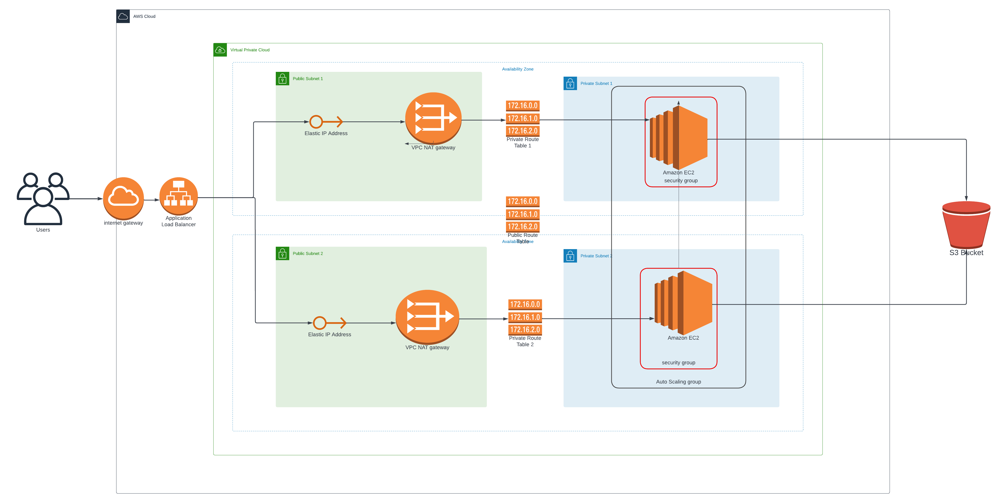

# Deploy a High-Availability Web App using CloudFormation

This repository contains the code and images for the solution to Udacity Cloud DevOps engineer Nanodegree Project 2 - [Deploy a High-Availability Web App using CloudFormation](https://learn.udacity.com/nanodegrees/nd9991-alg-t2/parts/cd0648/lessons/337b3d22-03c0-4e2e-9cb5-485f624ea72b/concepts/81af62b6-3f02-4d0a-a16e-2dc8dd08a5f3)

## Table of Contents

- [```images/```](./images/) directory contains screenshots

- [```stacks/```](./stacks/) directory contains the CloudFormation templates

## Load Balancer
The load balancer URL that leads to the web page is http://serve-albwe-j7akspmo89d-907520412.us-east-1.elb.amazonaws.com/

## Infrastructure Diagram
This is the infrastructure diagram

